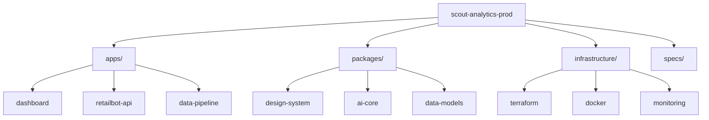

# Scout Analytics Production Repository

## Project Structure


## Getting Started
```bash
# Install dependencies
npm install

# Build all packages
npm run build

# Run tests
npm test

# Deploy to production
npm run deploy
```

## Key Configuration Files
- `specs/dashboard_end_state.yaml`: Main dashboard configuration
- `.github/workflows/ci.yml`: CI/CD pipeline
- `infrastructure/monitoring/dashboard.json`: Monitoring config
