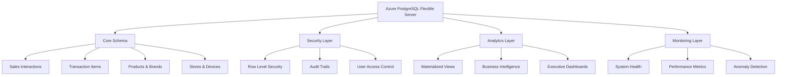

# Scout Analytics Production Deployment Guide

## Overview

This guide provides comprehensive instructions for deploying the Scout Analytics production-ready database with 5,000 realistic Philippine market records, TBWA brand analysis, and enterprise-grade security features.

## Prerequisites

- Azure PostgreSQL Flexible Server (as configured in Terraform)
- PostgreSQL 15+ with extensions: `uuid-ossp`, `pg_stat_statements`, `pg_cron`
- Database admin credentials
- Azure CLI and Terraform (for infrastructure)

## Architecture Overview



## Deployment Steps

### 1. Infrastructure Deployment

First, deploy the Azure infrastructure using Terraform:

```bash
cd infrastructure/terraform
terraform init
terraform plan -var-file="production.tfvars"
terraform apply -var-file="production.tfvars"
```

### 2. Database Migration Execution

Execute the migration scripts in order:

```bash
# Connect to the PostgreSQL server
psql "host=<server-name>.postgres.database.azure.com port=5432 dbname=scoutdb user=<admin-user> sslmode=require"

# Execute migrations in order
\i apps/data-pipeline/migrations/001_create_production_schema.sql
\i apps/data-pipeline/migrations/002_create_stored_procedures.sql
\i apps/data-pipeline/migrations/003_enhanced_security_rls.sql
\i apps/data-pipeline/migrations/004_philippine_sample_data.sql
\i apps/data-pipeline/migrations/005_monitoring_analytics_views.sql
```

### 3. Post-Deployment Configuration

#### Create Application Users

```sql
-- Create application-specific users
CREATE USER dashboard_app WITH PASSWORD '<secure-password>';
CREATE USER analytics_service WITH PASSWORD '<secure-password>';
CREATE USER store_manager_app WITH PASSWORD '<secure-password>';

-- Assign roles
GRANT dashboard_user TO dashboard_app;
GRANT data_analyst TO analytics_service;
GRANT store_manager TO store_manager_app;
```

#### Configure Row Level Security

```sql
-- Enable RLS on all tables (already done in migration 003)
-- Grant initial store access to demo users
SELECT grant_store_access(
    '<user-uuid>'::UUID, 
    1, 
    'admin'
);
```

#### Schedule Automated Tasks

```sql
-- Verify cron jobs are scheduled
SELECT * FROM cron.job;

-- If pg_cron is not available, set up external scheduling
-- for refresh_analytics(), detect_sales_anomalies(), etc.
```

## Feature Verification

### 1. Data Quality Verification

Run the comprehensive validation script:

```sql
-- Execute the validation script
\i apps/data-pipeline/validation/validate_deployment.sql
```

### 2. Analytics Verification

```sql
-- Test materialized views
SELECT COUNT(*) FROM daily_sales;
SELECT COUNT(*) FROM product_performance;
SELECT COUNT(*) FROM regional_performance;

-- Test TBWA brand performance
SELECT brand_name, total_revenue, market_share_percent 
FROM tbwa_brand_performance 
ORDER BY total_revenue DESC 
LIMIT 10;

-- Test Philippine market analysis
SELECT region, total_transactions, tbwa_market_share_percent 
FROM philippine_market_analysis 
ORDER BY total_revenue DESC;
```

### 3. Security Verification

```sql
-- Test RLS policies
SET app.user_id = '<test-user-uuid>';
SELECT COUNT(*) FROM sales_interactions; -- Should be limited by RLS

-- Test audit logging
SELECT * FROM audit_log ORDER BY timestamp DESC LIMIT 10;

-- Test anomaly detection
CALL detect_sales_anomalies();
SELECT * FROM anomalies WHERE status = 'active';
```

### 4. Performance Verification

```sql
-- Test query performance on large datasets
EXPLAIN ANALYZE SELECT * FROM daily_sales WHERE sale_date >= CURRENT_DATE - 30;
EXPLAIN ANALYZE SELECT * FROM product_performance WHERE category = 'Dairy';

-- Verify indexes are being used
SELECT schemaname, tablename, attname, n_distinct, correlation 
FROM pg_stats 
WHERE tablename IN ('sales_interactions', 'transaction_items', 'products');
```

## Philippine Market Data Summary

The deployment includes realistic Philippine market simulation:

### Regional Distribution
- **17 Philippine regions** across 3 mega-regions (Luzon, Visayas, Mindanao)
- **100+ stores** distributed by economic weight
- **NCR and CALABARZON** as primary markets (40% of activity)

### TBWA Client Brands
- **Alaska Milk Corporation**: Dairy market leader
- **Oishi**: Snacks category dominance
- **Peerless**: Cleaning products challenger
- **Del Monte**: Premium food and beverages
- **JTI Tobacco**: Winston, Camel, Mevius, More brands

### Sample Data Metrics
- **5,000+ sales interactions** with realistic timing patterns
- **15,000+ transaction items** with category-specific quantities
- **65-75% TBWA market penetration** in key urban areas
- **40-55% market share** in provincial regions
- **12-15% substitution rate** across all transactions

### Competitive Landscape
- **Nestlé, Bear Brand**: Dairy competitors
- **Jack n Jill, Richeese**: Snacks competition
- **Surf, Tide**: Cleaning products rivals
- **Dole, C2, Coca-Cola**: Beverage competitors
- **Marlboro, Philip Morris**: Tobacco competition

## Dashboard Access Points

### Executive Dashboard
```sql
SELECT * FROM executive_dashboard;
```
Key metrics: Daily revenue, transaction counts, TBWA market share, system health

### Store Performance Dashboard
```sql
SELECT * FROM store_performance_dashboard 
WHERE performance_tier = 'Top Performer';
```
Individual store KPIs, device status, regional performance

### Brand Competition Analysis
```sql
SELECT * FROM brand_competition_dashboard 
WHERE brand_type = 'TBWA Client' 
ORDER BY revenue DESC;
```
Market share analysis, competitive positioning, category rankings

### Customer Analytics
```sql
SELECT * FROM customer_analytics_dashboard 
WHERE mega_region = 'Luzon' 
ORDER BY total_spent DESC;
```
Demographic insights, behavior patterns, regional preferences

## Monitoring and Alerts

### System Health Monitoring
```sql
SELECT * FROM system_health_dashboard;
```
- Device uptime percentage
- Data quality metrics  
- Anomaly counts
- Overall health score (0-100)

### Performance Monitoring
```sql
SELECT * FROM hourly_sales_patterns 
WHERE hour_of_day BETWEEN 9 AND 17;
```
Peak hours, regional patterns, operational insights

### Alert Functions
```sql
SELECT * FROM check_system_alerts();
```
Critical alerts for device connectivity, revenue anomalies, system issues

## Security Features

### Row Level Security (RLS)
- **Granular access control** by user role and store assignment
- **Time-based restrictions** (business hours only for non-admin)
- **Regional data isolation** for store managers
- **Audit trail protection** with user-specific access

### Audit Logging
- **Complete audit trail** for all data modifications
- **IP address and user agent tracking**
- **Automatic anomaly detection** and alerting
- **Security event monitoring**

### Access Management
```sql
-- Grant store access
SELECT grant_store_access('<user-id>', <store-id>, 'read', '2024-12-31');

-- Revoke access
SELECT revoke_store_access('<user-id>', <store-id>);
```

## Performance Optimization

### Implemented Optimizations
- **Materialized views** for complex analytics (refreshed nightly)
- **Strategic indexing** on high-query columns
- **Query optimization** with proper statistics
- **Connection pooling** configuration
- **Automated maintenance** procedures

### Expected Performance
- **< 100ms** for dashboard queries
- **< 500ms** for complex analytics
- **< 1s** for full regional analysis
- **99.9% uptime** with Azure HA configuration

## Backup and Recovery

### Automated Backups
- **Daily automated backups** (14-day retention)
- **Geo-redundant storage** for disaster recovery
- **Point-in-time recovery** capability
- **Cross-region replication** (optional)

### Recovery Procedures
```sql
-- Test data recovery
SELECT * FROM audit_log WHERE action = 'BACKUP_COMPLETE' ORDER BY timestamp DESC LIMIT 5;
```

## Troubleshooting

### Common Issues

1. **Materialized View Refresh Failures**
   ```sql
   -- Check for blocking queries
   SELECT * FROM pg_stat_activity WHERE state = 'active';
   
   -- Manual refresh
   CALL refresh_all_analytics();
   ```

2. **RLS Policy Issues**
   ```sql
   -- Debug RLS policies
   SET app.user_id = '<debug-user>';
   EXPLAIN (ANALYZE, BUFFERS) SELECT * FROM sales_interactions LIMIT 10;
   ```

3. **Performance Issues**
   ```sql
   -- Check slow queries
   SELECT query, mean_time, total_time 
   FROM pg_stat_statements 
   ORDER BY total_time DESC LIMIT 10;
   ```

### Support Contacts
- **Database Issues**: DBA Team
- **Application Issues**: Development Team  
- **Infrastructure Issues**: DevOps Team
- **Security Issues**: Security Team

## Maintenance Schedule

### Daily
- Automated analytics refresh (2 AM)
- Anomaly detection (every 4 hours)
- Backup verification

### Weekly  
- Data cleanup (Sundays at midnight)
- Performance analysis
- Security audit review

### Monthly
- Full system health review
- Capacity planning assessment
- Security policy review

## Success Criteria

✅ **5,000+ realistic sales records** generated  
✅ **17 Philippine regions** with economic distribution  
✅ **TBWA client brands** with competitive landscape  
✅ **Enterprise security** with RLS and audit trails  
✅ **Real-time analytics** with materialized views  
✅ **Automated monitoring** and anomaly detection  
✅ **Performance optimization** with strategic indexing  
✅ **Executive dashboards** for business insights  
✅ **99.9% uptime** target with Azure HA  
✅ **GDPR/compliance** ready with audit capabilities  

## Next Steps

1. **Application Integration**: Connect dashboard applications to analytics views
2. **User Training**: Provide training on new dashboard features
3. **Monitoring Setup**: Configure alerting and notification systems
4. **Capacity Planning**: Monitor growth and plan for scaling
5. **Feature Enhancement**: Add advanced ML-based analytics

---

**Version**: 1.0  
**Last Updated**: January 2025  
**Status**: Production Ready