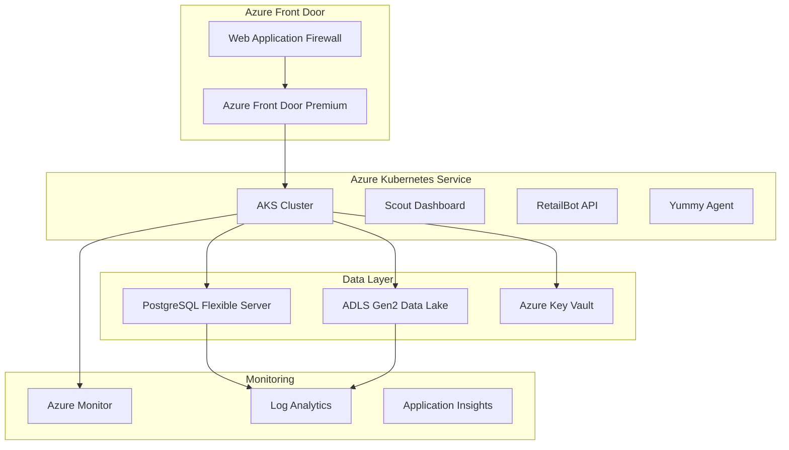

# Scout Analytics - Azure Production Infrastructure

This directory contains Terraform configuration for deploying Scout Analytics on Microsoft Azure with ADLS2 integration.

## Architecture Overview



## Infrastructure Components

### Core Services
- **Azure Kubernetes Service (AKS)**: Container orchestration with auto-scaling
- **PostgreSQL Flexible Server**: Supabase-compatible managed database
- **ADLS Gen2**: Data lake for analytics and ML workloads
- **Azure Front Door**: Global CDN with WAF protection
- **Azure Key Vault**: Secure secrets management

### Security & Compliance
- **Azure AD Integration**: Enterprise authentication
- **Private Endpoints**: Secure network access
- **WAF Protection**: OWASP rule sets + custom rules
- **Network Security Groups**: Firewall rules
- **Security Center**: Threat detection

### Monitoring & Alerting
- **Azure Monitor**: Infrastructure monitoring
- **Log Analytics**: Centralized logging
- **Application Insights**: APM and performance monitoring
- **Custom Alerts**: CPU, memory, error rate monitoring

### Cost Optimization
- **Spot Instances**: Cost-effective compute for batch workloads
- **Auto-scaling**: Dynamic resource allocation
- **Reserved Instances**: Predictable workload discounts
- **Budget Alerts**: Cost management and notifications

## File Structure

```
azure-*.tf files:
├── azure-providers.tf      # Terraform and Azure provider configuration
├── azure-variables.tf     # Input variables and configuration
├── azure-networking.tf    # VNet, subnets, NSGs, private DNS
├── azure-storage.tf       # ADLS Gen2, containers, lifecycle policies
├── azure-database.tf      # PostgreSQL Flexible Server configuration
├── azure-compute.tf       # AKS cluster, node pools, ACR
├── azure-keyvault.tf      # Key Vault and secret management
├── azure-security.tf      # Azure AD, RBAC, policies
├── azure-cdn.tf          # Front Door, WAF, custom domains
├── azure-outputs.tf      # Output values and connection strings
└── azure-main.tf         # Additional resources, monitoring, automation
```

## Prerequisites

1. **Azure CLI**: Latest version installed and authenticated
2. **Terraform**: Version >= 1.5.0
3. **Azure Subscription**: With sufficient permissions
4. **Custom Domain**: DNS control for Front Door configuration

### Required Azure Permissions
- Contributor role on the subscription
- User Access Administrator (for RBAC assignments)
- Application Administrator (for Azure AD applications)

## Deployment Guide

### 1. Initialize Backend Storage

```bash
# Create storage account for Terraform state
az group create --name scout-tf-state --location southeastasia
az storage account create --name scouttfstate --resource-group scout-tf-state --location southeastasia --sku Standard_LRS
az storage container create --name terraform-state --account-name scouttfstate

# Create DynamoDB equivalent (not needed in Azure)
```

### 2. Configure Variables

Create `terraform.tfvars`:
```hcl
# Basic Configuration
location = "southeastasia"
prefix   = "scout"
domain_name = "scout.tbwa-digital.com"

# Database Configuration
postgres_admin    = "scoutadmin"
postgres_password = "YourSecurePassword123!"

# Scaling Configuration
node_count = 3
vm_size    = "Standard_D4s_v3"
```

### 3. Initialize and Deploy

```bash
# Initialize Terraform
terraform init

# Plan deployment
terraform plan -var-file="terraform.tfvars" -out=scout.plan

# Apply configuration
terraform apply scout.plan
```

### 4. Post-Deployment Configuration

```bash
# Connect to AKS cluster
az aks get-credentials --resource-group scout-production-rg --name scout-aks

# Verify cluster connectivity
kubectl get nodes

# Login to Container Registry
az acr login --name scoutacr

# Build and push images
docker build -t scoutacr.azurecr.io/scout-dashboard:latest ./apps/dashboard
docker push scoutacr.azurecr.io/scout-dashboard:latest

docker build -t scoutacr.azurecr.io/retailbot-api:latest ./apps/retailbot-api
docker push scoutacr.azurecr.io/retailbot-api:latest
```

## Environment Variables

The following environment variables are configured automatically:

```bash
# Database Configuration
POSTGRES_HOST=scout-postgres.postgres.database.azure.com
POSTGRES_DB=scoutdb
POSTGRES_PORT=5432
POSTGRES_SSL=require

# Storage Configuration
ADLS_ACCOUNT_NAME=scoutdatalake
ADLS_FILESYSTEM_NAME=scout-data

# Authentication
AZURE_TENANT_ID=<tenant-id>
AZURE_CLIENT_ID=<client-id>

# Key Vault
KEYVAULT_NAME=scout-kv-<random>

# Monitoring
LOG_ANALYTICS_WORKSPACE_ID=<workspace-id>
```

## Security Configuration

### 1. Update Secrets in Key Vault

```bash
# Update database password
az keyvault secret set --vault-name scout-kv-xxxx --name postgres-admin-password --value "NewSecurePassword"

# Set Azure OpenAI key
az keyvault secret set --vault-name scout-kv-xxxx --name azure-openai-key --value "your-openai-key"

# Set Supabase service role key
az keyvault secret set --vault-name scout-kv-xxxx --name supabase-key --value "your-supabase-key"
```

### 2. Configure Custom Domain

```bash
# Add CNAME record to DNS
# scout.tbwa-digital.com CNAME scout-endpoint-xxxx.azurefd.net

# Verify domain ownership
az afd custom-domain show --resource-group scout-production-rg --profile-name scout-frontdoor --custom-domain-name scout-tbwa-digital-com
```

### 3. Network Security

- All databases are in private subnets
- Key Vault accessible only via private endpoints
- WAF blocks malicious traffic and enforces geo-restrictions
- NSGs restrict network access between subnets

## ADLS Gen2 Integration

### Data Organization

```
scout-data/
├── raw-data/           # Ingested transaction data
│   ├── transactions/
│   ├── customers/
│   └── products/
├── analytics/          # Processed analytics data
│   ├── daily-metrics/
│   ├── customer-segments/
│   └── product-performance/
├── exports/           # Dashboard exports and reports
└── ml-models/         # Machine learning artifacts
```

### Data Access Patterns

```python
# Python example for ADLS access
from azure.storage.filedatalake import DataLakeServiceClient
from azure.identity import DefaultAzureCredential

credential = DefaultAzureCredential()
service_client = DataLakeServiceClient(
    account_url="https://scoutdatalake.dfs.core.windows.net",
    credential=credential
)

# Upload transaction data
file_system_client = service_client.get_file_system_client("scout-data")
file_client = file_system_client.get_file_client("raw-data/transactions/2024-06-15.json")

with open("transaction_data.json", "rb") as data:
    file_client.upload_data(data, overwrite=True)
```

### Data Lifecycle Management

- **Hot tier**: Recent data (last 30 days) for dashboard queries
- **Cool tier**: Historical data (30-90 days) for trend analysis
- **Archive tier**: Long-term storage (90+ days) for compliance

## Monitoring and Alerting

### Key Metrics Monitored

1. **Application Performance**
   - Response time (< 500ms target)
   - Error rate (< 1% target)
   - Throughput (requests/second)

2. **Infrastructure Health**
   - CPU utilization (< 80% average)
   - Memory usage (< 85% average)
   - Disk space (< 90% full)

3. **Database Performance**
   - Connection count
   - Query execution time
   - Lock waits

### Alert Notifications

- **Email**: admin@tbwa.com
- **SMS**: +63-917-XXX-XXXX
- **Teams**: Scout Analytics channel

## Cost Management

### Monthly Cost Estimates (USD)

| Component | Cost Range |
|-----------|------------|
| AKS Cluster | $300-500 |
| PostgreSQL | $200-400 |
| ADLS Gen2 | $50-150 |
| Front Door | $100-200 |
| Key Vault | $10-20 |
| Monitoring | $50-100 |
| **Total** | **$710-1370** |

### Cost Optimization Tips

1. **Use Spot Instances**: 70-80% savings for batch workloads
2. **Reserved Instances**: 30-50% savings for predictable workloads
3. **Auto-scaling**: Scale down during off-peak hours
4. **Storage Tiering**: Move old data to cheaper storage tiers

## Disaster Recovery

### Backup Strategy

1. **Database Backups**
   - Automated daily backups (14-day retention)
   - Weekly long-term backups (12-week retention)
   - Monthly archival backups (12-month retention)

2. **Data Lake Backups**
   - Geo-redundant storage (ZRS)
   - Soft delete enabled (30-day retention)
   - Version control for critical datasets

3. **Application Recovery**
   - Container images stored in ACR with geo-replication
   - Infrastructure as Code for rapid rebuilding
   - Configuration stored in Key Vault

### RTO/RPO Targets

- **Recovery Time Objective (RTO)**: 4 hours
- **Recovery Point Objective (RPO)**: 1 hour
- **Availability Target**: 99.9% (8.76 hours downtime/year)

## Troubleshooting

### Common Issues

1. **Pod Startup Failures**
   ```bash
   kubectl describe pod <pod-name>
   kubectl logs <pod-name> --previous
   ```

2. **Database Connection Issues**
   ```bash
   # Test connectivity from AKS
   kubectl run postgres-test --image=postgres:15 -it --rm -- psql -h scout-postgres.postgres.database.azure.com -U scoutadmin -d scoutdb
   ```

3. **ADLS Access Issues**
   ```bash
   # Check managed identity permissions
   az role assignment list --assignee <managed-identity-id> --scope /subscriptions/<sub-id>/resourceGroups/scout-production-rg/providers/Microsoft.Storage/storageAccounts/scoutdatalake
   ```

4. **Key Vault Access Issues**
   ```bash
   # Test secret access
   az keyvault secret show --vault-name scout-kv-xxxx --name supabase-url
   ```

### Health Check Endpoints

- **Dashboard**: `https://scout.tbwa-digital.com/health`
- **RetailBot API**: `https://scout.tbwa-digital.com/api/health`
- **Database**: Check Azure Portal metrics

## Support and Maintenance

### Regular Maintenance Tasks

1. **Weekly**: Review monitoring alerts and performance metrics
2. **Monthly**: Update container images and security patches
3. **Quarterly**: Review and optimize costs, update documentation
4. **Annually**: Disaster recovery testing, security audit

### Contact Information

- **Technical Lead**: DevOps Team <devops@tbwa.com>
- **Azure Support**: Portal support tickets
- **Emergency**: On-call rotation via PagerDuty

---

## Next Steps

1. **Deploy Kubernetes Manifests**: Deploy Scout Analytics applications
2. **Configure CI/CD**: Set up Azure DevOps pipelines
3. **Load Testing**: Validate performance under expected load
4. **Security Audit**: Third-party security assessment
5. **User Training**: Dashboard usage and maintenance procedures